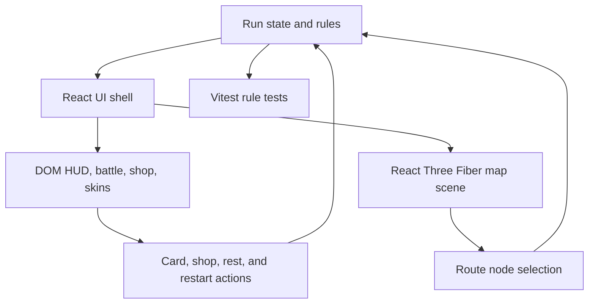

# Adventure Card Game Prototype Plan

## Problem Frame

Build a playable roguelike deck adventure from the empty `adventure-charge` repo. The player should move across route nodes on three maps, fight enemy encounters with cards, visit shops to buy stronger cards, collect keys, unlock one of four character skins through difficult progress, and use the three keys to enter a final boss battle.

The goal is a complete browser-playable prototype rather than a large content-heavy RPG. The game should be understandable without instructions outside the app, run locally, and keep gameplay rules separated from rendering so it can grow later.

## Scope

In scope:

- A React and React Three Fiber browser game shell with a 3D adventure map and DOM HUD.
- Runtime support for user-provided `.glb` people/enemy assets and a `.spz` scene backdrop, with procedural fallbacks while assets are absent.
- Three sequential maps, each with route choices between encounter, shop, rest, treasure, elite, and gate nodes.
- Turn-based card battles where the player and enemy draw cards, attack, block, and use defence.
- Enemy card turns that can attack, block, or apply pressure instead of using fixed scripted damage only.
- Shops where the player spends coins on cards.
- Four playable character skins, with three locked behind demanding unlock conditions.
- Key collection after each map boss and a final boss gate requiring three keys.
- Focused game-rule tests for deck handling, combat, progression gates, and unlocks.

Out of scope for this prototype:

- Online accounts, multiplayer, cloud saves, or payments.
- Large card libraries, animation-heavy cutscenes, audio, or authored 3D character assets.
- Persistent local storage beyond the current in-memory run.
- Perfect balance; values should support a tough but playable prototype.

## Requirements Traceability

- R1: The player has cards and can use them to attack or defend.
- R2: Enemies have cards and can block attacks or attack the player.
- R3: The player chooses routes on a map while going on an adventure.
- R4: Shops allow buying stronger cards.
- R5: Character skins can be unlocked, there are only four, and unlocking should be difficult.
- R6: Keys are earned before battling the big boss.
- R7: The big boss only becomes available after finishing the three maps.
- R8: The result is playable as a browser game in this repo.

## Assumptions

- "People (skins)" means cosmetic character choices with different visuals and names, not separate classes with unique balance.
- "Finish the 3 maps" means beating a map guardian at the end of each map and gaining one key per guardian.
- "Wild animals" means enemy adventure encounters themed as hostile beasts; the prototype can represent them with 3D shapes and names rather than finished art assets.
- The first delivery should prioritise complete gameplay over lots of cards or polished art.
- User-provided assets can be discovered through a small public asset manifest rather than hard-coded imports.

## Existing Patterns

The repo currently contains only `README.md`, so there are no local application patterns to preserve. The implementation should establish a small Vite React app and follow React Three Fiber guidance:

- Simulation state belongs in plain TypeScript modules under `src/game/`.
- Rendering and scene composition belong under `src/components/`.
- HUD, buttons, cards, shop, battle panels, and unlock surfaces stay in DOM React, not inside the WebGL scene.
- The 3D scene should provide the map atmosphere and route nodes while the rules remain serialisable.

## Key Technical Decisions

1. Use Vite, React, TypeScript, Three.js, React Three Fiber, and Drei.
   - Rationale: the requested game benefits from React-managed UI and a small 3D map, and the named skill explicitly targets React Three Fiber.

2. Load optional `.spz` scenes through Spark and optional `.glb` models through Drei GLTF helpers.
   - Rationale: Spark currently supports `.SPZ` Gaussian splats in Three.js, while Drei provides a standard React Three Fiber path for GLB/glTF assets.

3. Keep game rules in pure TypeScript reducers/helpers.
   - Rationale: combat, map progression, rewards, and unlocks need deterministic tests without depending on canvas rendering.

4. Model the adventure as a single run state.
   - Rationale: the prototype needs route choice, battles, shops, keys, and unlock progress, but not durable saves yet.

5. Represent cards and enemy intent with shared card definitions.
   - Rationale: the player and enemies both use card-like actions, which keeps blocking and attacking behaviour visible and balanced in one place.

6. Use procedural 3D primitives for the first map scene.
   - Rationale: the repo has no assets, and primitives are enough to make a responsive 3D route map that can later be swapped for GLB assets.

## Implementation Units

### U1: Project Scaffold

Files:

- `package.json`
- `index.html`
- `tsconfig.json`
- `vite.config.ts`
- `src/main.tsx`
- `src/App.tsx`
- `src/styles.css`

Work:

- Create a Vite React TypeScript app shell.
- Install runtime dependencies for React, Three.js, React Three Fiber, and Drei.
- Add Vitest configuration for rule tests.
- Replace the placeholder README with local run and test instructions.

Test scenarios:

- `npm run build` produces a production build.
- `npm run test` discovers and runs game-rule tests once U2-U4 exist.

### U2: Game Data and Rule Engine

Files:

- `src/game/types.ts`
- `src/game/cards.ts`
- `src/game/maps.ts`
- `src/game/enemies.ts`
- `src/game/gameState.ts`
- `src/game/gameState.test.ts`

Work:

- Define card, deck, actor, enemy, node, map, shop, skin, and run-state types.
- Add starter and shop cards with attack, block, heal, draw, and coin costs.
- Build three maps with branching nodes and a guardian at the end of each.
- Create enemy decks and intents for normal encounters, elite encounters, guardians, and the final boss.
- Implement pure helpers for new run creation, drawing, playing player cards, enemy card turns, rewards, shop purchases, node travel, map completion, key collection, and final boss unlock.

Test scenarios:

- Starting a run gives the player a deck, hand, health, coins, zero keys, map one, and only the first skin unlocked.
- Playing an attack card reduces enemy block before health.
- Playing a defence card increases player block and prevents incoming enemy attack damage.
- Enemy turns draw from enemy cards and can either attack or block.
- Completing each map guardian grants one key and advances the map until three keys are held.
- The final boss cannot start before three keys and can start after three keys.
- Buying a shop card spends coins and adds the card to the deck; unaffordable cards cannot be bought.
- Unlock conditions expose exactly four skins and keep the rarer skins locked until demanding thresholds are reached.

### U3: React Game Shell and HUD

Files:

- `src/App.tsx`
- `src/components/BattleView.tsx`
- `src/components/CardButton.tsx`
- `src/components/Hud.tsx`
- `src/components/MapPanel.tsx`
- `src/components/ShopView.tsx`
- `src/components/SkinPanel.tsx`
- `src/components/RunSummary.tsx`
- `src/components/StartScreen.tsx`
- `src/game/useGame.ts`

Work:

- Wire the pure game engine into React state with a small custom hook.
- Add start, map, battle, shop, rest, treasure, victory, defeat, and final boss states.
- Let the player select route nodes, play cards, end turns, buy cards, rest, claim treasure, change unlocked skins, and restart.
- Keep key resources visible: health, block, coins, keys, map number, current skin, deck size, and enemy intent.

Test scenarios:

- Component smoke coverage is limited to build verification for this prototype.
- Manual browser smoke checks cover route selection, battle turn flow, shop purchase, skin selection, and boss gate visibility.

### U4: React Three Fiber Map Scene

Files:

- `src/components/AdventureScene.tsx`
- `src/components/RouteNodeMesh.tsx`
- `src/components/MapPath.tsx`
- `src/components/SceneAssets.tsx`
- `src/game/assets.ts`
- `src/game/useAssetManifest.ts`
- `public/assets/adventure-assets.json`

Work:

- Render the current map as a full-bleed 3D scene using procedural geometry.
- Highlight available route choices, completed nodes, locked boss gate, and the selected path.
- Keep camera controls gentle and prevent the HUD from blocking route interaction.
- Use colour and shape differences for encounters, shops, rests, treasures, elites, guardians, and the final boss.
- Load a provided `.spz` scene backdrop when present in the asset manifest.
- Load provided `.glb` models for selected skins and current battle enemies when present in the asset manifest.
- Keep procedural node, player, and enemy fallbacks when asset files are absent.

Test scenarios:

- `npm run build` verifies the Three.js/R3F code compiles.
- Browser smoke checks confirm the canvas is non-blank, map nodes are visible on desktop and mobile widths, and selecting route nodes changes game state.
- Browser smoke checks confirm absent `.glb`/`.spz` assets do not break the game and that manifest paths are documented for future assets.

### U5: Balance, Polish, and Documentation

Files:

- `src/styles.css`
- `README.md`

Work:

- Tune card values, enemy health, coins, and rewards so the prototype is difficult but not impossible.
- Add responsive styling for battle hands, shop rows, HUD, and mobile map layout.
- Document local development, build, and test commands.

Test scenarios:

- Build passes after styling and content changes.
- A manual run can progress through at least the first map.
- A developer can follow README commands from a clean checkout after installing dependencies.
- README explains where to put `.glb` and `.spz` files and how to edit the asset manifest.

## System-Wide Impact

## Risks and Mitigations

- Risk: the scope becomes too large for one prototype.
  - Mitigation: keep content counts intentionally small: three maps, four skins, a concise card pool, and procedural visuals.

- Risk: UI state and game rules become tangled.
  - Mitigation: keep card combat and progression in `src/game/` and test those helpers directly.

- Risk: R3F rendering fails silently in the browser.
  - Mitigation: verify with a local dev server and browser smoke checks after implementation.

- Risk: unlocks feel arbitrary.
  - Mitigation: surface unlock requirements in the skin panel and make hard conditions explicit.

## Verification Plan

- Run `npm install` after scaffold creation.
- Run `npm run test` for pure game-rule coverage.
- Run `npm run build` for TypeScript and production bundle verification.
- Start the dev server and manually smoke test:
  - Start a run.
  - Pick a route node on the 3D map.
  - Win or lose a normal battle turn cycle with attack and block cards.
  - Visit a shop and buy a card.
  - Confirm skins show four options with locked requirements.
  - Confirm the boss gate is locked before three keys.

## Deferred Follow-Up Work

- Persistent save data and run history.
- More cards, enemies, maps, boss phases, and unlockable cosmetics.
- Audio, animation polish, custom models, and particle effects.
- Accessibility pass for keyboard-only route and card selection.
